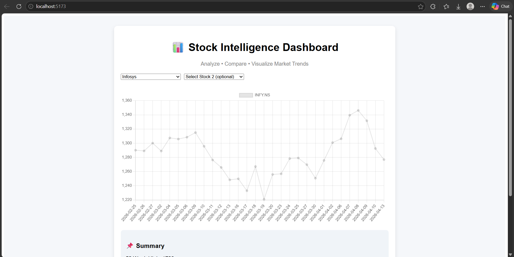
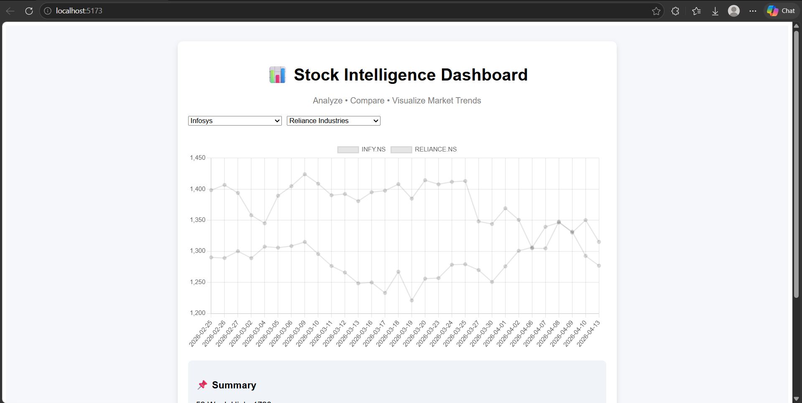
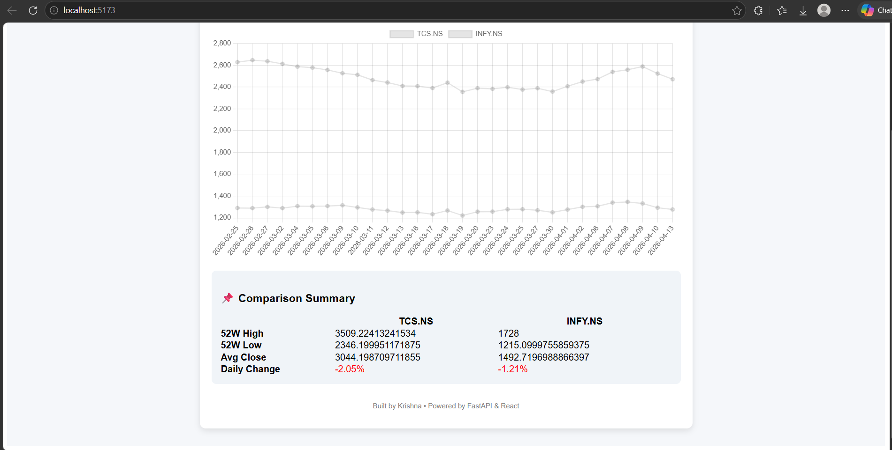

# 📊 Stock Intelligence Dashboard

A full-stack financial data platform that allows users to analyze stock market data, visualize trends, and compare company performance.

---

## 🚀 Features

- 📈 Fetch real-time stock data using yfinance
- 🔍 View last 30 days of stock performance
- 📊 Interactive charts using React + Chart.js
- 📉 7-day Moving Average visualization
- 📌 52-week High, Low, and Average summary
- ⚖️ Compare two stocks simultaneously
- ⚡ Fast backend with FastAPI
- 🎨 Clean and responsive UI

---

## 🧱 Tech Stack

### Backend
- Python
- FastAPI
- Pandas
- yfinance

### Frontend
- React (Vite)
- Chart.js
- Axios

---

## ⚙️ API Endpoints

| Endpoint | Description |
|---------|------------|
| `/companies` | List of available companies |
| `/data/{symbol}` | Last 30 days stock data |
| `/summary/{symbol}` | 52-week stats |
| `/compare` | Compare two stocks |

---

## 💡 Custom Features

- Volatility-aware data handling
- Dynamic column detection (robust to API changes)
- Multi-stock comparison visualization

---

## 🧠 Design Thinking

This project focuses on handling inconsistent financial data structures and providing meaningful insights through dynamic data processing and visualization.

## 🖥️ How to Run

### Backend
```bash
cd stock-dashboard
venv\Scripts\activate
uvicorn app.main:app --reload

## 📊 Dashboard Overview


## 📈 Stock Comparison


## 📈 Stock Comparison
